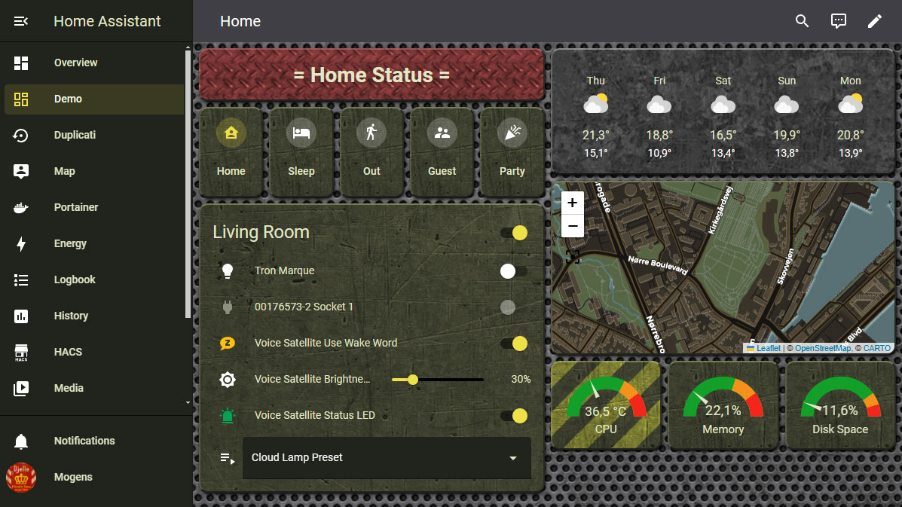

# Military Communication - Army Green
A theme for Home Assistant.

## UPDATE v2.0:
- Fixed sliders having some wrong colors.
- Renamed the sub-themes to something human readable. Which means that if you have used these, you will need to reselect them in the dashboard editor for each card affected. Sorry about the trouble.
- Changed the color of MilCom Army - Emphasize (former MilCom Army CARD3) to dark red.
- Added a new sub-theme: MilCom Army - Attention.
- Noticed that not all of the sub-themes attributes was inherited from the main theme. So added all attributes related to cards to each sub-theme.

## 
This is my first project for HA/Hacs/GitHub. So bear with me if something is not quite right.

It has three sub-themes. Which can be used for individual cards (See screenshot). These are not ment to be used as a main themes.
- MilCom Army - Monotone: A darker gray background.
- MilCom Army - Emphasize: Red background with more texture.
- MilCom Army - Attention: Green background with yellow warning lines.

Install via Hacs on Home Assistant. Select “Custom repositories” in Hacs and paste in this link: https://github.com/Djelle/milcomarmy

Or if you have to manually install it: Also move/copy the image files from /themes/milcomarmy/ to /www/milcomarmy/ on your server.

## Screenshot

I am not able to test this with all cards. So if you find something that looks wrong, please inform me.
